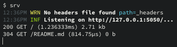

# srv



`srv` is a simple simple web server meant for quick, local use.

It includes:

- Simple directory listing
- Support for [Cloudflare style](https://developers.cloudflare.com/pages/configuration/headers/) `_headers` files
- Dead simple to launch, just type `srv`

## Installing

For macOS, `srv` is available via my tools [Homebrew](https://brew.sh) tap: `brew install jmhobbs/tools/srv`

Otherwise, you can download the latest binaries from the releases page on GitHub.

## Usage

This server is not meant to be a production web server, just for quick little tests and moving files around.

```
usage: srv [options] [directory]

  -access-log string
        Where to write access logs, default is STDOUT. Pass empty string to disable. (default "-")
  -default-dir-files string
        Default files to show for directory, when present. (default "index.html,index.htm")
  -headers-file string
        Path to _headers file to apply. (default "_headers")
  -interface string
        Network interface to listen on (default "127.0.0.1")
  -p int
        Port to listen on (default 5050)
  -q    Quiet mode, disable most logging
  -v    Verbose mode, enable debug logging
  -version
        Show version and exit
```
